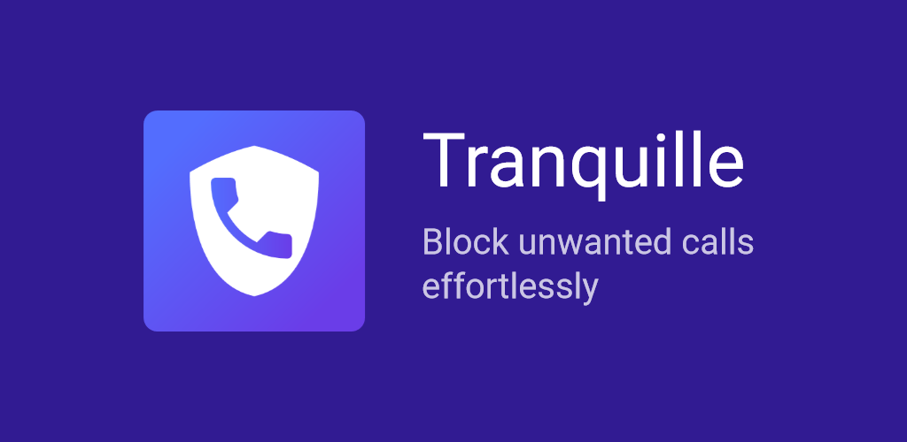
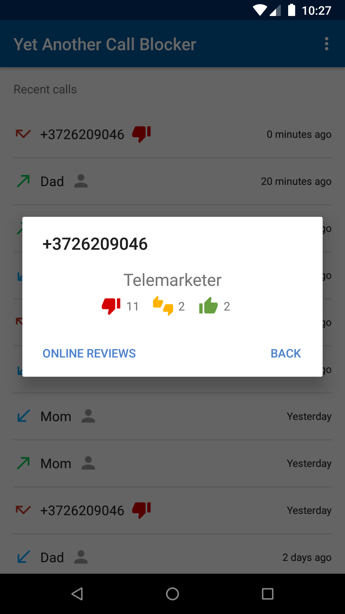
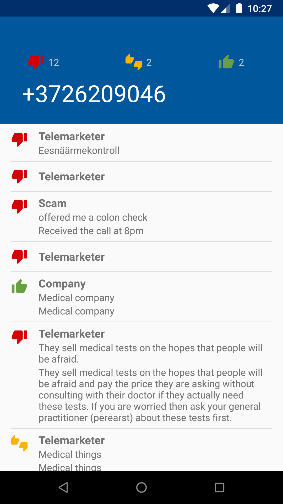
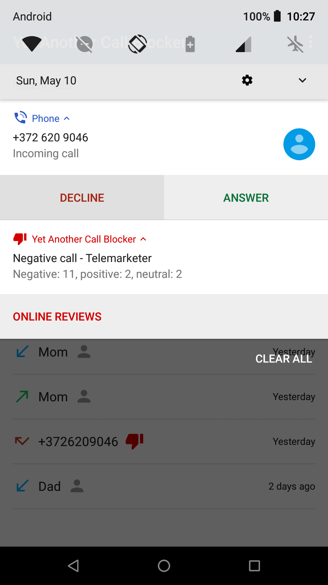

      
      

# Tranquille
**Disclaimer:** This is a free and open source project, but it relies on third-party web-services for some functions to work. This project is not affiliated with any third-party entities in any other sense.

A free and open source application that can block unwanted calls or warn about probable intentions of callers using a third-party crowdsourced phone number database (from some other proprietary app).

## Key features

* Uses offline database.
* Blocks calls with negative rating automatically (option).
* Local blacklist with wildcard support.
* Displays a notification with phone number summary (rating, reviews count, category) during incoming calls (option).
* Automatic incremental/delta database updates (option).
* You can view online reviews for caller's number (provided by 3rd party service).
* "Advanced call blocking mode" for blocking calls on Android 7+ before the phone starts ringing (needs to be manually enabled in Settings).

## How to use

* [Install](https://f-droid.org/app/dummydomain.yetanothercallblocker) and launch the app.
* The option to show caller info notifications is enabled by default, so the app will ask for phone-related permissions.
* At first start, the app will suggest to download main database which is required for most of the functions. Simply confirm the download.  
  (The DB is downloaded from [another gitlab repo](https://gitlab.com/xynngh/YetAnotherCallBlocker_data), so no privacy-related implications.)
* Check the "Auto-update database" checkbox in the menu (recommended) to automatically receive daily DB updates (these are incremental/delta updates, so they consume very little traffic).
* Check the "Block by rating" checkbox to block calls with negative rating automatically.
* You can also check the "Use contacts" checkbox if you want your contacts not to be treated as unknown callers.
* After these steps everything should just work (but you can always find more options in Settings). Enjoy!

See [frequently asked questions](FAQ.md) to learn more.

## [Screenshots](fastlane/metadata/android/en-US/images/phoneScreenshots/)

## More on features

At this point most of the essential features (one would expect from a call blocking app) are implemented. Here's an overview:

* Automatic blocking of calls with negative rating, calls from hidden or locally blacklisted numbers. *Works offline.*  
  Call blocking should work on most Android versions (including Android 10).  
  Some phones (like some Xiaomi) [require](https://gitlab.com/xynngh/YetAnotherCallBlocker/-/issues/12) to enable "Advanced call blocking mode" or a monitoring service.
* Local blacklist with wildcard support.  
  Import of NoPhoneSpam backup is supported.
* Showing a notification with some caller info (positive/negative rating, category, number of negative reviews and such) when the phone's ringing. *Works offline.*
* Loading and displaying a list of reviews for a number (accessed from the notification or the info view). *Requires internet.*
* Automatic update of the database (for offline use). *Requires internet.*
* Displaying call log with caller rating and the ability to show more info or load online reviews for the number. The list *works offline*, but loading reviews *requires internet.*
* If "use contacts" option is enabled, the numbers present in the phone book are never blocked and the contact name is displayed next to/instead of a number throughout the app.
* "Advanced call blocking mode" for blocking calls on Android 7+ before the phone starts ringing.  
  Needs to be manually enabled in app Settings.

## Privacy

Protecting the user's privacy is the first concern during development. No personal data is sent to or otherwise shared with anyone.
The only known possible data leaks (to the third-party servers) are the following:

* Database update procedure leaks user's IP address to the update servers.  
  The request also includes current database version (base or updated)  
  and a country code (either auto-detected or set manually).
* Online review requests leak user's IP address coupled with the phone number in question.  
  The request also includes country codes (either auto-detected or set manually).  
  Shouldn't be a big deal unless you request it for numbers in your phone book.  
  If the "use contacts" feature is enabled, a confirmation dialog is shown if online reviews are requested for a number present in your phone book.

No other identifiable information is sent with the requests.

## Available data

The following data is available in the main offline database:

* a phone number,
* a category (telemarketers, dept collectors, scam, etc.),
* a number of negative reviews,
* a number of positive reviews,
* a number of neutral reviews.

The main database may receive delta updates from third-party servers.

The "featured" database provides "names" (company names or short descriptions) for some (presumably) subset of numbers in the main database.

The third-party servers can be queried for a list of detailed user reviews for a specific phone number.
A detailed review contains:

* A rating: positive, negative or neutral.
* A category: each review may have a different one.
* A title and a comment: the actual description the user left for the number.

## Rationale

Some may find the original application (whose DB and servers are used) hard to trust because of its proprietary nature (and also the use of firebase analytics and the like).  
But since the database behind that application is crowdsourced, some may find it acceptable (in a moral sense) to use that database in a separate open source application.  
Also, this project is meant to be non-commercial. So, there's that.

## License

[AGPLv3-only](https://www.gnu.org/licenses/agpl-3.0.en.html).

## Contributing

Any contributions are welcome.

[Translate the app on Weblate](https://hosted.weblate.org/engage/tranquille).

[More on contributing](CONTRIBUTING.md).

## Building

See [BUILDING.md](BUILDING.md).
